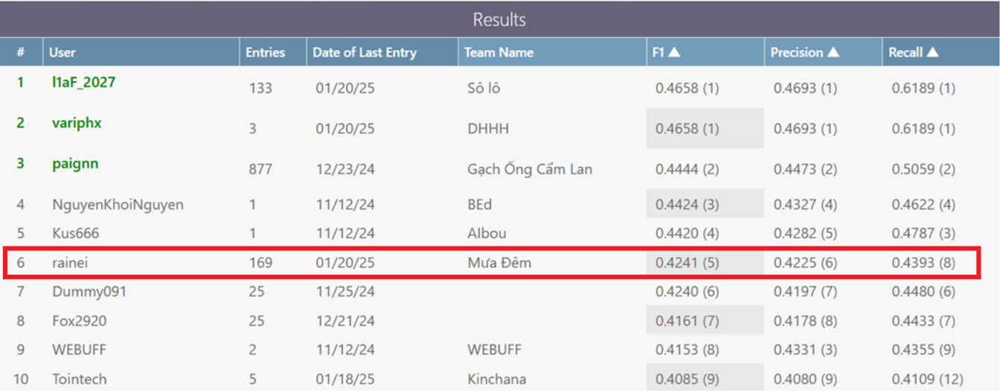

# Vietnamese Multimodal Sarcasm Detection

## Project Description

This project focuses on detecting sarcasm in Vietnamese multimodal content, specifically images paired with captions. It leverages image content, text captions, and Optical Character Recognition (OCR) extracted from images to build a robust sarcasm detection model. The project aims to classify content into four categories: `multi-sarcasm`, `text-sarcasm`, `image-sarcasm`, and `not-sarcasm`.

## Dataset


This project is designed to work with a dataset of image-caption pairs annotated with sarcasm labels, for specific: ViMMSD. The dataset should be structured as a JSON file where each entry includes:

*   `image`:  Filename of the image.
*   `caption`: Text caption associated with the image.
*   `label`: Sarcasm label (`multi-sarcasm`, `text-sarcasm`, `image-sarcasm`, `not-sarcasm` for training data).

You can download the dataset [here](https://www.kaggle.com/datasets/sieugadvn/vimmsd).

## Models

This project utilizes pre-trained transformer models for feature extraction:

*   **Image Encoder:**  `google/vit-base-patch16-224` (Vision Transformer) is used to extract visual features from images.
*   **Text Encoder 1:** `jinaai/jina-embeddings-v3` is used to extract text embeddings from captions.
*   **Text Encoder 2:** `vinai/phobert-base-v2`** - Used as a second text encoder to capture potentially different aspects of the text (optional, depends on `train_features_dir2` and `test_features_dir2` usage in `main.py`).

## Features

The project extracts and combines the following features:

*   **Image Features:**  Extracted directly from images using the image encoder.
*   **Text Features:**  Embeddings generated from captions using the text encoders.
*   **OCR Features:**  Text extracted from images using OCR (pre-processed and cached). These features are also embedded using the text encoder.
*   **Combined Image Features:** Concatenation of raw image features, processed image features, and processed OCR features.

These features are pre-extracted and saved as `.npy` files for efficient training and testing.

## Model Architecture

The sarcasm classification model is built using PyTorch and consists of the following components:

*   **Feature Processing Layers:** Dense layers to process and reduce the dimensionality of image, text, and OCR features.
*   **Feature Fusion:**  Different fusion methods are implemented:
    *   `concat`:  Simple concatenation of image and text features.
    *   `attention`: Self-attention mechanism to learn relationships within the combined features.
    *   `cross_attention`: Cross-attention mechanisms to learn interactions between image and text features.
*   **Classification Layer:** A fully connected layer followed by a softmax to predict the sarcasm class.
*   **Loss Functions:** Supports both:
    *   `focal`: Focal Loss to address class imbalance.
    *   `cross_entropy`: Standard Cross-Entropy Loss.

## Requirements

*   Python 3.8+
*   PyTorch >= 2.0.0
*   torchvision >= 0.15.0
*   transformers >= 4.30.0
*   numpy >= 1.23.0
*   pandas >= 1.5.0
*   opencv-python >= 4.7.0
*   tqdm >= 4.65.0
*   scikit-learn >= 1.2.0
*   Pillow >= 9.4.0

Install the required packages using:

```bash
pip install -r requirement.txt
```

## Setup

1.  **Clone the repository:**

    ```bash
    git clone https://github.com/3NDQ/CS221.P12-Final-Project.git
    cd CS221.P12-Final-Project
    ```

2.  **Install dependencies:**

    ```bash
    pip install -r requirement.txt
    ```

3.  **Prepare your dataset:**

    *   Place your image dataset in a directory (e.g., `datasets/images`).
    *   Create your training/testing JSON data files (e.g., `data/train.json`, `data/test.json`) according to the dataset format described above.
    *   Please take a look at our `run_notebook` folder to gain more information about OCR process.

## Usage

### 1. Feature Extraction

Run `extract_features.py` to extract image, text, and OCR features and save them as `.npy` files.

**For Training Data:**

```bash
python extract_features.py \
    --data_path data/train.json \
    --image_folder datasets/images/train \
    --ocr_cache_path data/ocr_cache_train.json \
    --output_dir train_features \
    --mode train \
    --image_model_name google/vit-base-patch16-224 \
    --text_model_name jinaai/jina-embeddings-v3
```

**For Testing Data:**

```bash
python extract_features.py \
    --data_path data/test.json \
    --image_folder datasets/images/test \
    --ocr_cache_path data/ocr_cache_test.json \
    --output_dir test_features \
    --mode test \
    --image_model_name google/vit-base-patch16-224 \
    --text_model_name jinaai/jina-embeddings-v3
```

**Note:**

*   Adjust `--data_path`, `--image_folder`, `--ocr_cache_path`, and `--output_dir` according to your data paths.
*   `--mode` should be `train` or `test`.
*   You can change `--image_model_name` and `--text_model_name` to experiment with different pre-trained models.

### 2. Training the Model

Run `main.py` in `train` mode to train the sarcasm classifier.

```bash
python main.py --mode train \
    --train_features_dir train_features \
    --train_features_dir2 train_features_v2 \ # Example for a second feature set
    --val_size 0.2 \
    --batch_size 32 \
    --num_epochs 20 \
    --patience 5 \
    --learning_rate 3e-5 \
    --fusion_method concat \ # or attention, cross_attention
    --loss_type focal      # or cross_entropy
    --gamma 2.0
    --label_smoothing 0.15
```

**Note:**

*   `--train_features_dir` should point to the directory where you saved the training features.
*   `--train_features_dir2` is optional for a second feature set (e.g., features from a different text model). If not used, set it to the same as `--train_features_dir`.
*   Adjust hyperparameters like `--val_size`, `--batch_size`, `--num_epochs`, `--patience`, `--learning_rate`, `--fusion_method`, `--loss_type`, `--gamma`, and `--label_smoothing` as needed.

### 3. Testing the Model

Run `main.py` in `test` mode to evaluate trained models on the test data.

```bash
python main.py --mode test \
    --test_features_dir test_features \
    --test_features_dir2 test_features_v2 \ # Example for a second feature set
    --batch_size 32 \
    --model_paths model_epoch_10.pth model_epoch_15.pth  # Example model paths
    --fusion_method concat # Match the fusion method used during training
```

**Note:**

*   `--test_features_dir` should point to the directory where you saved the test features.
*   `--test_features_dir2` is optional for a second feature set. If not used, set it to the same as `--test_features_dir`.
*   `--model_paths` should be a list of paths to the trained model files (e.g., `.pth` files saved during training).
*   `--fusion_method` should match the fusion method used when training the models you are testing.
*   The test results will be saved as `results_model_*.json` files in the project directory.

## File Descriptions

*   `.gitignore`: Specifies intentionally untracked files that Git should ignore.
*   `extract_features.py`:  Script to extract image, text, and OCR features using pre-trained models and save them as `.npy` files.
*   `main.py`: Main entry point for the project. Handles argument parsing and runs either training (`run_train.py`) or testing (`run_test.py`) based on the `--mode` argument.
*   `model_factory.py`: Contains functions to load pre-trained transformer models (tokenizer, text encoder, image encoder, image processor).
*   `process_datasets.py`: Defines PyTorch Dataset classes (`TrainSarcasmDataset`, `TestSarcasmDataset`) for loading and preprocessing the data.
*   `run_test.py`: Script for testing trained models on the test dataset and generating prediction results in JSON format.
*   `run_train.py`: Script for training the sarcasm classification model, including data loading, training loop, validation, early stopping, and model saving.
*   `requirement.txt`: List of Python package dependencies for the project.
*   `sarcasm_model.py`: Defines the PyTorch model architecture (`VietnameseSarcasmClassifier`) for sarcasm detection, including feature processing, fusion methods, and classification layers.
*   `utils.py`: Contains utility functions and classes, such as:
    *   `CrossAttention`, `SelfAttention`: Custom attention layer implementations.
    *   `FocalLoss`, `WeightedCrossEntropyLoss`: Loss function implementations.
    *   `EarlyStopping`:  Early stopping mechanism for training.
    *   `evaluate_model`: Function to evaluate model performance on the validation set.

## Results


## License

Cuộc thi Khoa học Dữ liệu UIT – Bộ môn Khoa học Dữ liệu, Khoa Khoa học và Kỹ thuật Thông tin, Trường Đại học Công nghệ Thông tin , ĐHQG-HCM

## Contact

| Họ và Tên            | Email                     | Github                                                                                                                      |
| ------------------- | ------------------------- | --------------------------------------------------------------------------------------------------------------------------- |
| Tăng Nhất             | 22521027@gm.uit.edu.vn     | [](https://github.com/GadGadGad) |
| Lê Cảnh Nhật            | 22521016@gm.uit.edu.vn     | [](https://github.com/nhatle10) |
| Lê Minh Nhựt          | 22521060@gm.uit.edu.vn     | [](https://github.com/leeminsun1205) |
| Trần Đình Khánh Đăng  | 22520195@gm.uit.edu.vn     | [](https://github.com/ra1nei) |
